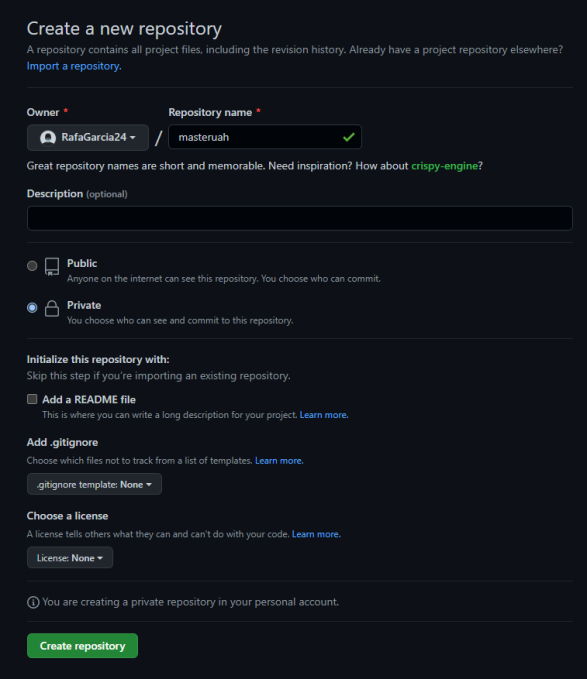
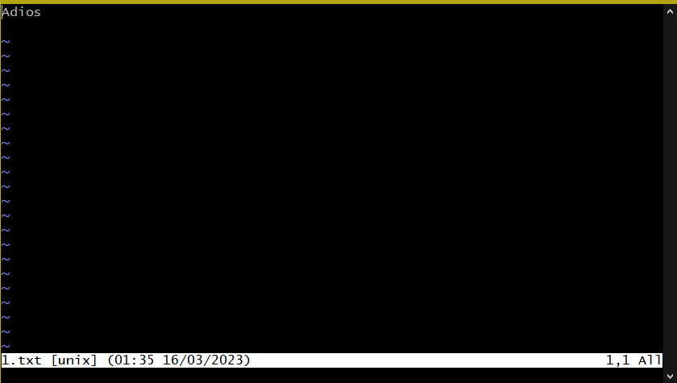
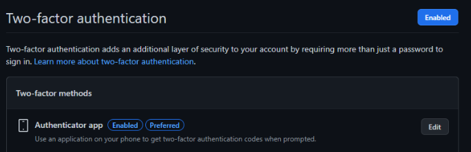
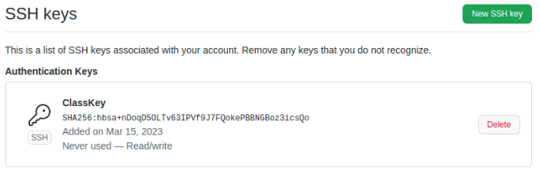
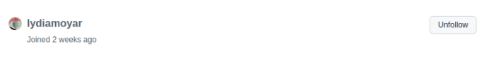
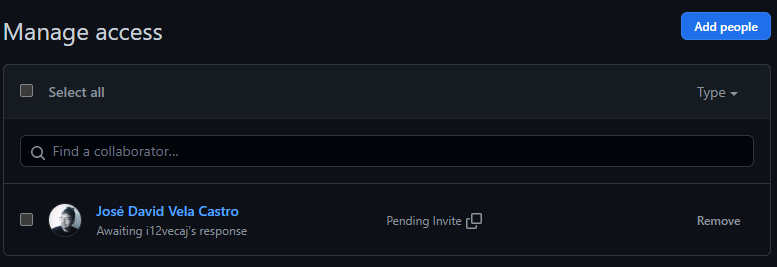
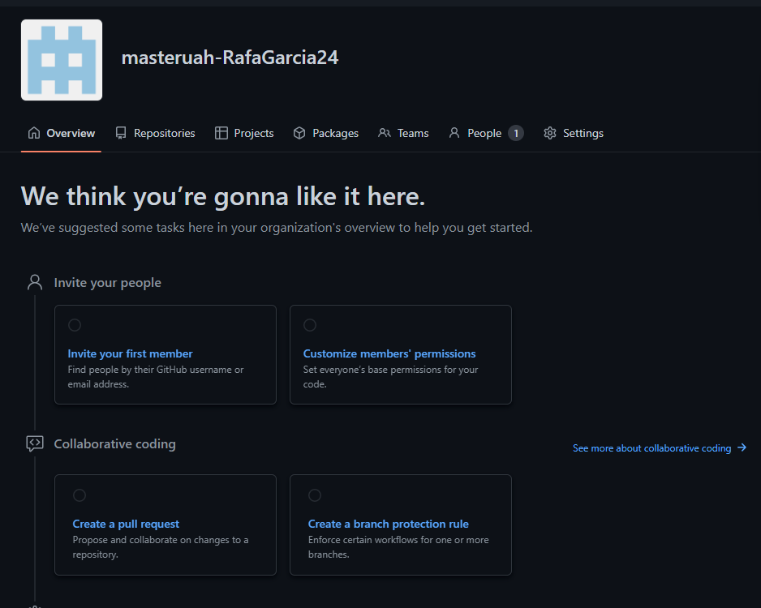

1. Crear un repositorio en vuestro GitHub llamado **masteruah**.

2. Clonar vuestro repositio en local.

git clone https://github.com/RafaGarcia24/masteruah.git

3. Crear (si no lo habéis creado ya) en vuestro repositorio local
  un documento **README.md**. 
 
El documento README.md se creo automaticamente al crear el repositorio.

4. Añadir al README.md los comanddos utilizados hasta ahora
  y hacer un coomit inicial con el mensaje **commit inicial**.
  
git commit -m "commit inicial"

5. Subir los cambios al repositorio remoto.n llamada **masteruah-tunombredeusua

git push

6. Añadir fichero **1.txt** al repositorio local.

echo "1" > 1.txt

7. Crear un tag **v0.1**.
  
git tag v0.1

8. Subir los cambios al repositorio remoto.

git push --tag

9. Crear una rama **v0.2**.

git branch v0.2

10. Posiciona tu carpeta de trabajo en esta rama.

git checkout v0.2

11. Añadir un fichero **2.txt** en la rama **v0.2**.

echo "2" > 2.txt

12. Subir los cambios al reposiorio remoto.

git push --branch

13. Posicionarse en la rama **master**.

git checkout main

14. Hacer un merge de la rama **v0.2** en la rama **master**.

git merge v0.2

15. En la rama **master** poner **Hola** en el fichero **1.txt** y hacer commit.

16. Posicionarse en la rama **v0.2** y poner **Adios** en el fichero "1.txt" y hacer commit.

17. Posicionarse de nuevo en la rama **master** y hacer un merge con la rama **v0.2**

+ git checkout (rama al la que quieras pasar)
+ git merge (ramas que quieras unir a la rama en la que estes)

18. Listar las ramas con merge y las ramas sin merge.

Con merge: git branch --merge
Sin merge: git branch --no-merge

19. Arreglar el conflicto anterior y hacer un commit.

vim (nombre del archivo que da conflicto)

20. Crear un tag **v0.2**

git tag v0.2

21. Borrar la rama **v0.2**

git branch -D v0.2

22. Listar los distintos commits con sus ramas y sus tags.

git status (para comporbar los errores)

23. Poner una foto en vuestro perfil de GitHub.

24. Poner el doble factor de autentificación en vuestra cuenta de GitHub.

25. Añadir (si no lo habéis hecho ya) la clave pública que se corresponde a tu ordenador.

26. Preguntar los nombres de usuario de GitHub de tus compañeros de trabajo en grupo, búscalos, y sigueles.

27. Añadir una estrella a los repositorios del resto de tus compañeros.

28.Crear una tabla de este estilo en el fichero **README.md** con la información
  de varios de tus compañeros de clase

|        NOMBRE          |                           GITHUB                        |
|------------------------|---------------------------------------------------------|
| Lydia Moya Ruiz | [enlace a github](https://github.com/lydiamoyar/masteruah.git) |

29. Poner a [github.com/i12vecaj](http://github.com/i12vecaj) como colaborador
  del repositorio **masteruah**
  

30. Crear una organización llamada **masteruah-tunombredeusuariodegithub**

 

